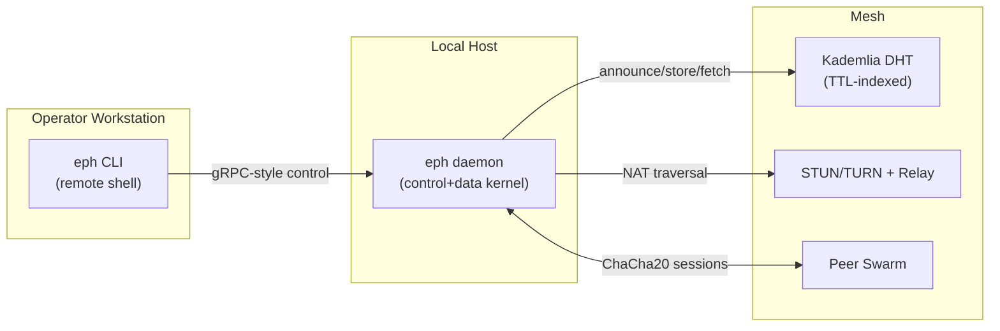

<p align="center">
  
</p>

# EphemeralNet

**A secure P2P network with custom Relay for hostile NATs, built in C++20.**

> Programmable forgetting for high-assurance peer-to-peer storage.

[](https://github.com/ShardianLabs/EphemeralNet/actions/workflows/ci.yml)
[](LICENSE)
[](https://github.com/ShardianLabs/EphemeralNet/releases)


## Why EphemeralNet?

Shardian designs infrastructure for teams that take deletion guarantees as seriously as confidentiality. EphemeralNet is our C++20 research daemon for data that **must** disappear: a P2P protocol that uses enforced time-to-live (TTL) semantics as a first-class constraint. Instead of mutating BitTorrent-style swarms into ad-hoc retention policies, EphemeralNet treats each manifest, chunk, and routing hint as expendable material whose lifetime is negotiated at the edge and cryptographically enforced.

Every node runs `eph`, a compact daemon that exposes a gRPC-inspired control socket and a remote-style CLI. The kernel pairs a TTL-aware Kademlia DHT with ChaCha20/HMAC sessions, Shamir's Secret Sharing for key pulverization, and deterministic cleanup hooks so expired state evaporates across storage tiers, routing tables, and manifests simultaneously. The outcome is a mesh that can gossip, store, and fetch like a modern CDN overlay—while guaranteeing the data falls out of existence on schedule.

Unlike archival systems, EphemeralNet optimizes for *temporal correctness*: it verifies that a chunk **cannot** outlive its deadline, even if peers go offline. That makes it ideal for incident data rooms, temporary collaborative edits, and any workload that needs Zero Trust guardrails for deletion.

## High-Level Architecture



## Feature Highlights

- **TTL-native Kademlia**: XOR distance routing with per-entry expiry metadata so announcements self-destruct without operator intervention.
- **E2EE everywhere**: ChaCha20-Poly1305 for transport, HMAC-SHA256 for protocol integrity, and rolling session key derivation per peer.
- **Shamir-backed key expiry**: decryption keys are sharded across the DHT; when shards expire, the data becomes irrecoverable even if chunks linger in caches.
- **Control-plane proof-of-work**: adaptive PoW envelopes handshake, store, and manifest operations to blunt Sybil abuse while keeping honest peers fast.
- **NAT traversal + relay fallback**: built-in STUN/TURN learning, auto-promoted public endpoints, and an event-driven relay server for high-fanout bursts.
- **Deterministic storage hygiene**: in-memory and optional disk tiers, secure wiping, TTL audits, and notification hooks that synchronize cleanup with manifest withdrawal.
- **Observability first**: Prometheus exporters for TTL drift, PoW pressure, DHT saturation, and per-peer health to keep SREs ahead of runaway swarms.
- **CLI/daemon parity**: the same `eph` binary exposes both the background service and a remote control surface for automation-friendly operations.

## Quick Start Installation

| Platform | Command |
| -------- | ------- |
| Linux & macOS | `curl -sSf https://eph.shardian.com/install.sh \| sh` |
| Windows (PowerShell) | `iwr https://eph.shardian.com/install.ps1 -useb \| iex` |

> The install scripts download the latest release artifact from GitHub, place `eph` on your PATH, and print follow-up instructions.

## Usage

```powershell
# Start the daemon with loopback control plane, TCP transport on 45000
PS> eph start --storage-dir C:\temp\ephemeral --control-host 127.0.0.1

# Store a file with a 15-minute TTL; PoW is negotiated automatically
PS> eph store secrets.bin --ttl 900

# Fetch via manifest; direct-only keeps traffic on explicitly advertised peers
PS> eph fetch eph://6c5f... --direct-only --out C:\downloads

# Inspect node health, DHT saturation, and relay status
PS> eph status --verbose
```

## Building from Source

```powershell
# Configure (creates build/ and toolchain files)
cmake -S . -B build -DCMAKE_BUILD_TYPE=RelWithDebInfo

# Compile all targets (daemon, CLI, relay, tests)
cmake --build build --parallel

# Optional: execute the full test suite
ctest --test-dir build --output-on-failure
```

Use `-DEPHEMERALNET_BUILD_TESTS=OFF` to skip test binaries or `-GNinja` if you prefer Ninja builds.

## Documentation

The full operations handbook, protocol reference, and observability guides live at **[eph.shardian.com](https://eph.shardian.com)**. Offline copies are mirrored under `docs/` for air-gapped review.

## Contributing & License

Pull requests are welcome—start with a proposal in `docs/todo.md` or open a GitHub Discussion so we can align on scope. New modules should include design notes, telemetry hooks, and deterministic tests under `tests/`.

EphemeralNet is released under the [MIT License](https://github.com/shardianlabs/ephemeralnet/blob/main/LICENSE). By contributing you agree that your work will be licensed under MIT and that you have the right to do so.
