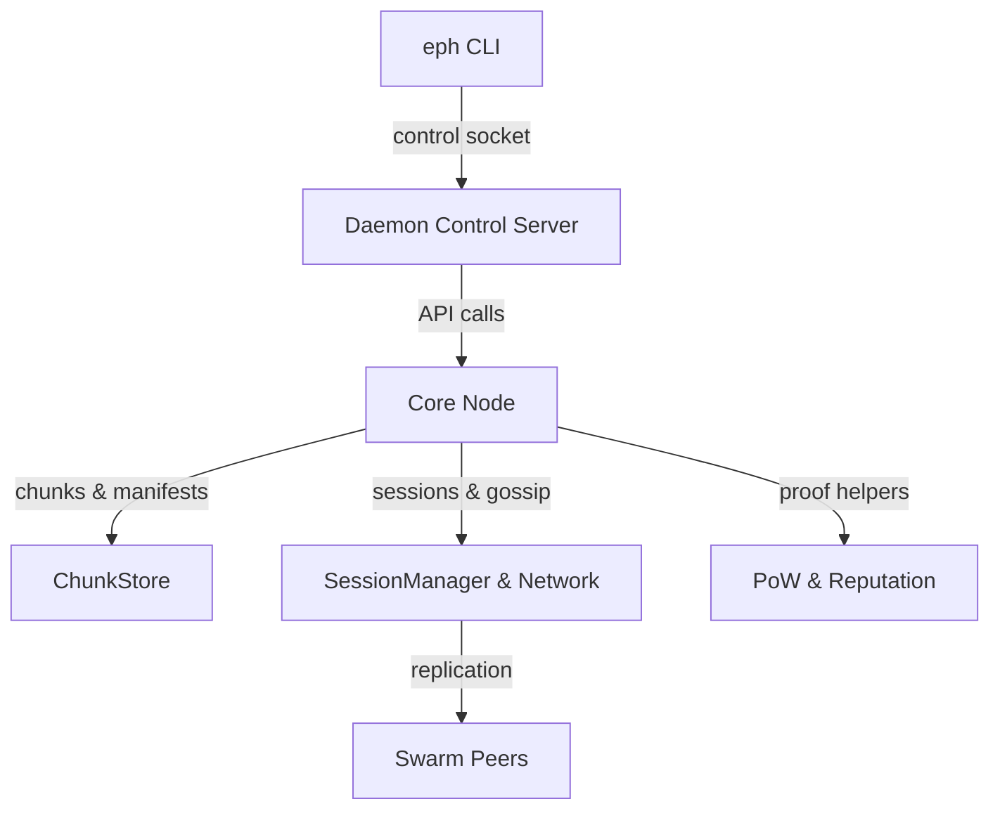

# System Architecture

EphemeralNet splits responsibilities so the CLI stays stateless while the daemon owns long-lived resources. The CLI marshals user intent, the daemon validates and routes requests, and the core node drives storage, gossip, TTL enforcement, and relay-aware networking.

## Design goals

- **Ephemerality first** – TTL metadata accompanies every chunk, manifest, and DHT record; sweeps (`Node::tick`) remove expired state deterministically.
- **Deterministic CLI** – The CLI shells commands to the daemon via a newline-delimited protocol, keeping automation simple and reproducible.
- **Composable node kernel** – `ephemeralnet::Node` orchestrates storage, gossip, NAT discovery, relay failover, DHT maintenance, and proof-of-work so future features plug in cleanly.
- **Security-in-depth** – ChaCha20 + HMAC-SHA256 for transport, multi-surface PoW (handshake, announce, store), secure wiping, and configurable governance hooks.
- **Operator visibility** – Structured logs, CLI snapshots (`status`, `defaults`, `list`), and metrics exported through the control plane or Prometheus-compatible stream.

## Control plane vs. data plane

| Plane | Implementation | Purpose |
|-------|----------------|---------|
| Control | `src/daemon/ControlServer.cpp`, `ControlPlane.cpp` | Parses CLI requests (`STORE`, `FETCH`, `STATUS`, `LIST`, `METRICS`, etc.), enforces authentication + PoW, streams results back to the CLI, and drives `Node::tick()`. |
| Data | `src/network/SessionManager.cpp`, `src/protocol/Message.cpp`, `src/core/SwarmCoordinator.cpp` | Maintains encrypted TCP sessions, replicates shards, fulfills fetches, validates ANNOUNCE payloads, and enforces TTL-aware gossip. |

The CLI only talks to the control plane. The daemon bridges to the data plane through the node.

## Subsystems at a glance

### CLI (`src/main.cpp`)
- Layers defaults, config files, profiles, environments, and CLI overrides to build `ephemeralnet::Config`.
- Manages daemon lifecycle for `serve`/`start`/`stop`, prompts users before destructive actions unless `--yes`.
- Streams payloads to the daemon (`STORE`) and writes chunk bytes to disk (`FETCH`).

### Daemon control server (`src/daemon`)
- Listens on TCP 47777 by default, parses newline-delimited headers, enforces payload limits, and validates optional control tokens.
- Routes commands to the node, rate limits uploads/fetches, logs structured events, and exposes Prometheus-formatted metrics via `METRICS`.

### Core node (`src/core/Node.cpp`)
- Owns the peer identity, PoW targets, TTL bounds, manifest encoding, swarm scheduling, and periodic maintenance (`tick`).
- Embeds helper subsystems: `ChunkStore`, `KademliaTable`, `SwarmCoordinator`, `ReputationManager`, NAT/relay managers, and diagnostics exporters.

### Storage subsystem (`src/storage/ChunkStore.cpp`)
- Stores encrypted chunk bytes in memory and optionally on disk, tagging each record with `expires_at`.
- Performs secure wiping when persistence is enabled and TTL expires.
- Supplies snapshots for `list`/`ttl-audit` use cases.

### Transport & discovery (`src/network`, `src/dht`, `src/protocol`)
- `SessionManager` accepts/dials encrypted TCP sessions, orchestrates transport handshakes, and hands decoded messages to the node.
- `KademliaTable` tracks provider records, shard metadata, TTL-aware buckets, and bootstrap peers.
- `protocol::Manifest` serializes chunk metadata, discovery hints, PoW requirements, and fallback URIs.
- NAT traversal (`NatTraversalManager`) and relay fallback (`RelayClient`) feed candidates into manifest discovery hints.

### Security helpers (`src/bootstrap`, `src/security`, `src/crypto`)
- `TokenChallenge` and `StoreProof` validate nonce submissions for bootstrap and store flows.
- `crypto::ChaCha20`, `HmacSha256`, and `Shamir` implement the primitives used across transport and manifest sharding.

## Node lifecycle

### Boot (`serve` / `start`)
1. CLI parses options, loads configuration, and either runs `ControlServer::serve()` in-process (`serve`) or spawns a detached daemon (`start`).
2. The daemon sanitizes TTL/PoW bounds, loads/generates the peer identity, starts the control socket, and binds the transport listener.
3. `Node::start_transport()` seeds the DHT from `Config::bootstrap_nodes`, primes NAT traversal, registers relay endpoints, and begins gossip.

### Store flow (`eph store …`)
1. CLI validates the file, enforces `--max-store-bytes`, and solves store PoW if required.
2. Daemon authenticates the request, enforces payload caps, and hands bytes to `Node::store_chunk()`.
3. The node encrypts/persists the chunk, builds the manifest (chunk hash, shards, TTL, hints, PoW advisory), and distributes shards through `SwarmCoordinator`.

### Fetch flow (`eph fetch eph://…`)
1. CLI decodes the manifest and attempts transport hints; on failure it falls back to control endpoints or the local daemon/DHT.
2. When the daemon handles the fetch, it streams the chunk immediately if local, otherwise registers the manifest and waits for swarm peers.
3. Responses include status codes, byte counts, and hints so automation can act deterministically.

### Periodic maintenance (`tick`)
- Executes on `Config::cleanup_interval` cadence.
- Sweeps expired chunks and DHT providers, performs secure wipes, rotates session keys, refreshes NAT diagnostics, and republishes manifests as needed.

### Shutdown (`eph stop` or daemon exit)
1. CLI sends `STOP`; the daemon stops accepting new clients and asks the node to drain uploads/downloads.
2. Transport sessions close, relay/NAT helpers release resources, and persisted chunks flush to disk.
3. CLI reports success once `STATUS:OK` is returned.

## Data flow & concurrency

- Control requests are processed sequentially per connection but dispatch asynchronous work (e.g., swarm fetches) via the node.
- Transport workers run independently, delivering decrypted messages into the node’s handlers.
- TTL enforcement happens deterministically via `tick` so sweeping remains predictable, even after restarts.

